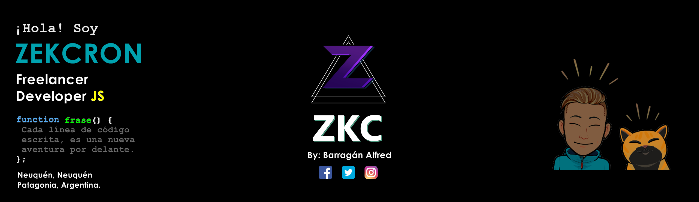
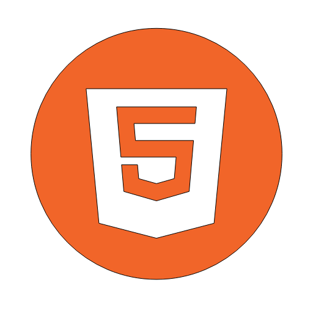
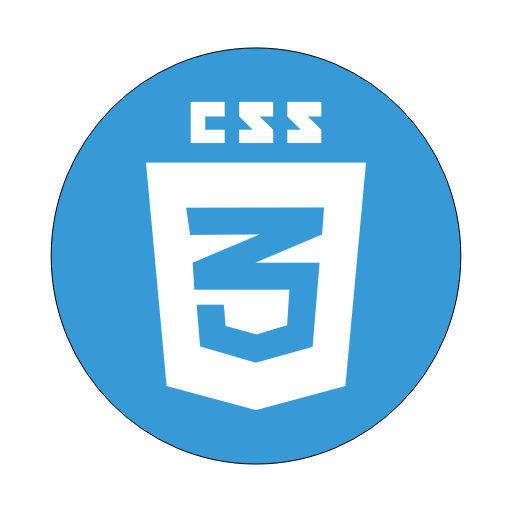
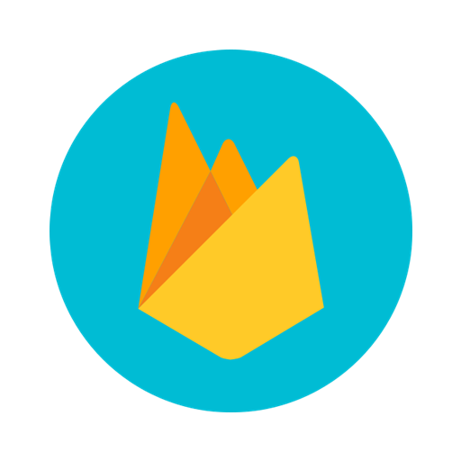

<link href="path/to/css/icono-arg.css" rel="stylesheet">

## Hola, mi nombre es [Barragán Alfred](https://alfred-miportafolio.netlify.app/) :alien:
**Alias: Zekcron ⚡**

**Freelance Developer JS**

 Soy estudiante autónomo y fanático del lenguaje de programación JavaScript.

---

### 
 :sparkles: Habilidades :sparkles: 

     

---

<!--
Here are some ideas to get you started:

- 🔭 I’m currently working on ...
- 🌱 I’m currently learning ...
- 👯 I’m looking to collaborate on ...
- 🤔 I’m looking for help with ...
- 💬 Ask me about ...
- 📫 How to reach me: ...
- 😄 Pronouns: ...
- ⚡ Fun fact: ...

-->
